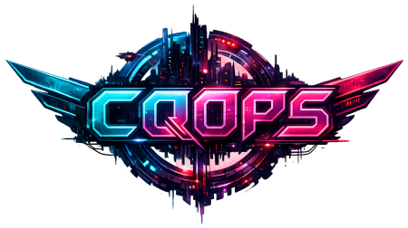
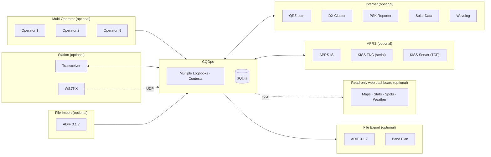
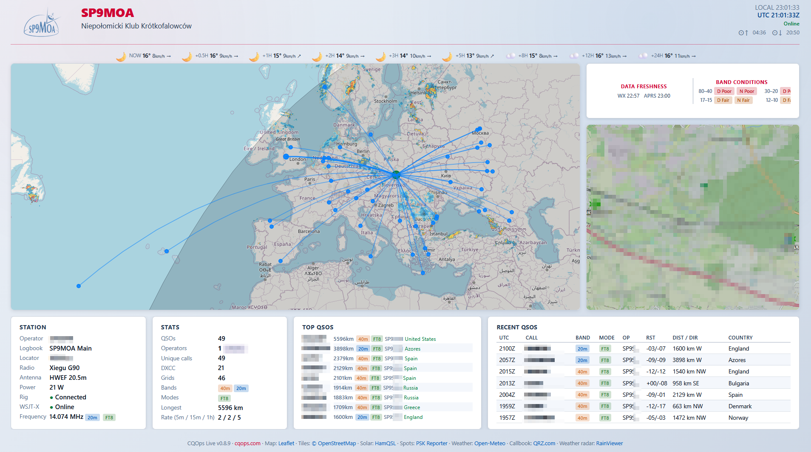

# CQOps

<p align="center">
  
</p>

[](https://github.com/szporwolik/cqops/releases)
[](https://go.dev/)
[](https://www.apache.org/licenses/LICENSE-2.0)
[](https://docs.cqops.com/)
[](https://cloudsmith.com)

A small, fast, offline-first amateur radio logger for the terminal - built for portable/field ops, SOTA/POTA activations, and club stations with rotating operators. Runs on Raspberry Pi, old laptops, or any low-power machine without a GUI, over SSH or a local terminal. Hot-swap operators and logbooks, log via WSJT-X auto-feed or keyboard, sync to Wavelog. GPS-aware - uses your receiver's position for the station grid automatically.

> 📖 **Full documentation, installation guides, and translations at [docs.cqops.com](https://docs.cqops.com/)** — English, Polski, Deutsch, Español, 日本語, Français, Italiano.

## Installation

### Windows

```powershell
winget install --exact --id SzymonPorwolik.CQOps
```

Update:
```powershell
winget upgrade --exact --id SzymonPorwolik.CQOps
```

> WinGet installation pending initial package acceptance at [microsoft/winget-pkgs](https://github.com/microsoft/winget-pkgs). Until then, use the portable ZIP or NSIS installer from [Releases](https://github.com/szporwolik/cqops/releases).

### Ubuntu, Linux Mint, Debian, Pop!_OS

```bash
curl -1sLf 'https://dl.cloudsmith.io/public/szporwolik/cqops/setup.deb.sh' | sudo -E bash
sudo apt update
sudo apt install cqops
```

### Fedora, RHEL, Rocky Linux, AlmaLinux

```bash
curl -1sLf 'https://dl.cloudsmith.io/public/szporwolik/cqops/setup.rpm.sh' | sudo -E bash
sudo dnf install cqops
```

### Go (universal)

```bash
go install github.com/szporwolik/cqops/cmd/cqops@latest
```

Requires Go 1.26+. This is the fallback for all platforms, not the recommended method for end users.

### Manual download

Grab the latest binary, installer, or package from the [Releases](https://github.com/szporwolik/cqops/releases) page — Windows portable ZIP, NSIS installer, macOS binaries, Linux `.deb`/`.rpm`, and portable tarballs for all platforms including Raspberry Pi.


## Features

- **Fast TUI logging** — three-column QSO form, dupe detection, form validation
- **Multi-operator** — hot-swap operators and logbooks for club stations
- **Rig control** — flrig and Hamlib rigctld, frequency/mode readback, spot-to-rig tuning
- **QRZ callbook** — auto-fills name, QTH, grid, country
- **Wavelog sync** — upload, incremental download, per-logbook config
- **Encrypted secrets** — AES-256-GCM, machine-tied, never plaintext
- **DX Cluster & PSK Reporter** — live spots with band/mode/time filters
- **GPS receiver** — serial or GPSD, live grid override for /P and mobile ops
- **APRS** — APRS-IS with live position map, station caching, GPS-aware beaconing
- **APRS KISS & KISS TCP**  — serial KISS TNC and KISS Server (Dire Wolf). 
- **CQOps Live** — built-in browser dashboard with live map, QSO paths, stats, weather, band conditions, APRS. Great for Field Day displays or club station screens
- **Contest logging** — exchange markers, auto serials, ADIF contest IDs
- **Offline-first** — SQLite, cached reference data, `--offline` flag
- **ADIF 3.1.7** — full import/export, contest fields preserved
- **Raspberry Pi ready** — Windows, Linux, macOS, ARM; runs over SSH
- **Kitty terminal graphics** 🧪 — photo display via Kitty/Ghostty/WezTerm. Enable in Settings → General.
- **Antenna rotator control** 🧪 — manual azimuth/elevation via hamlib. Enable in Rig Profiles.

See the [documentation](https://docs.cqops.com/) for detailed workflows, configuration, keyboard shortcuts, and troubleshooting.

## Architecture



## Screenshots

### App

<p align="center">
  
  
</p>
<p align="center">
  
  
</p>

### Dashboard

<p align="center">
  
</p>

## Requirements

- Go 1.26+
- Terminal with 80×24 minimum

## Build

```bash
git clone https://github.com/szporwolik/cqops.git
cd cqops
make build        # Build for current platform (output in build/)
make build-all    # Cross-compile for all platforms
make test         # Run tests
```

For smaller binaries, install [UPX](https://upx.github.io/) and run `upx --best build/cqops`.

See the [documentation](https://docs.cqops.com/manual.en.html#download--installation) for pre-built downloads and platform-specific installation.

## Usage

```bash
cqops              # Start the TUI
cqops --offline    # Start without network activity
cqops --version    # Print version and exit
cqops --help       # Show help
```

Full usage guide, workflows, and keyboard shortcuts are in the [documentation](https://docs.cqops.com/).

## Third-party party integrations and services
### Integrations
- [wsjtx-go](https://github.com/k0swe/wsjtx-go) — WSJT-X UDP protocol
- [farmergreg/adif](https://github.com/farmergreg/adif) + [farmergreg/spec](https://github.com/farmergreg/spec) — ADIF 3.1.7 parsing/writing & spec types
- [ftl/hamradio](https://github.com/ftl/hamradio) — Grid locator, distance math, DXCC prefix lookup (CTY.DAT)
- [gen2brain/beeep](https://github.com/gen2brain/beeep) — Desktop notifications

### Data & third-party services

*Reference data (loaded and cached locally):*
- [country-files.com](https://www.country-files.com/) — CTY.DAT DXCC prefix database by Jim Reisert AD1C (public domain factual data)
- [Super Check Partial](https://www.supercheckpartial.com/) — SCP callsign database by Stu Phillips K6TU (public domain contest data)
- [SOTA](https://www.sota.org.uk/) — Summits On The Air summit list (public data)
- [POTA](https://pota.app/) — Parks On The Air park list (public data)
- [WWFF](https://wwff.co/) — World Wide Flora & Fauna directory (public data)
- [IOTA](https://www.iota-world.org/) — Islands On The Air directory (personal non-commercial use per RSGB IOTA Ltd terms)

*Live data (online, cached locally):*
- [hamqsl.com](https://www.hamqsl.com/) — Solar conditions data (SFI, SSN, A/K indices) by Paul L Herrman N0NBH
- [PSK Reporter](https://pskreporter.info/) — Real-time propagation spot data by Philip Gladstone
- [Open-Meteo](https://open-meteo.com/) — Free weather forecast API (CC BY 4.0), fetched browser-side for the CQOps Live dashboard weather row

*CQOps Live dashboard — map tiles, weather radar, weather forecast, Leaflet:*
- Map tiles: [OpenFreeMap](https://openfreemap.org/) — © [OpenMapTiles](https://www.openmaptiles.org/) Data from [OpenStreetMap](https://www.openstreetmap.org/copyright) (ODbL). Styles: Bright (light theme), Fiord (dark theme).
- Map rendering: [MapLibre GL JS](https://github.com/maplibre/maplibre-gl) (BSD-3) + [MapLibre GL Leaflet](https://github.com/maplibre/maplibre-gl-leaflet) (ISC), loaded from CDN.
- Weather radar overlay: [RainViewer](https://www.rainviewer.com/) public API (browser-side, optional, offline-safe). Attribution displayed on-map and in footer.
- Weather forecast row: [Open-Meteo](https://open-meteo.com/) free API (browser-side, no key required, offline-safe: hidden when disconnected). Attribution in footer. See `licenses/OPEN-METEO-CC-BY-4.0.txt`.
- Leaflet 1.9.4 bundled under BSD-2. See `licenses/LEAFLET-BSD2-LICENSE`.
- Leaflet.Terminator (day/night grayline overlay) bundled under MIT. See `licenses/LEAFLET-TERMINATOR-MIT-LICENSE`.
- All services remain optional. CQOps and CQOps Live work offline with cached/local assets.
- Use of third-party services does not imply endorsement of CQOps by those projects.

*APRS-IS & APRS symbol graphics:*
- APRS symbol graphics are from the [aprs.fi APRS symbol set](https://github.com/hessu/aprs-symbols) by Heikki Hannikainen, OH7LZB. The graphics are third-party assets with mixed per-symbol copyright status — **not** covered by the CQOps Apache 2.0 license. Upstream copyright notes are preserved in [`third_party/aprs-symbols/COPYRIGHT.md`](third_party/aprs-symbols/COPYRIGHT.md). See [`third_party/NOTICE.md`](third_party/NOTICE.md) for details.
- APRS Mic-E and Base-91 position decoding in `internal/aprs/parse.go` is an independent implementation based on algorithms from [go-aprs-fap](https://github.com/la5nta/go-aprs) (BSD-style) and the APRS 1.0.1/1.2 specifications.

### Licensing
All licenses are permissive (MIT, Apache 2.0, BSD-2, BSD-3). See `licenses/` directory. Third-party asset notices are in `third_party/`.

## Special thanks

### Cloudsmith
Package repository hosting is graciously provided by [Cloudsmith](https://cloudsmith.com). Cloudsmith is the only fully hosted, cloud-native, universal package management solution, that enables your organization to create, store, and share packages in any format, to any place, with total confidence.

## Contributing

This is a personal project. Issues are welcome, and pull requests are accepted — please open them against the `dev` branch.

## License

[Apache-2.0](https://www.apache.org/licenses/LICENSE-2.0)

Copyright (C) 2025-2026 Szymon Porwolik
